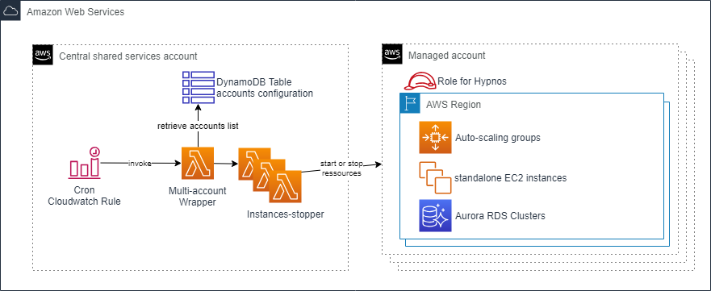

# AWS Hypnos

Hypnos takes care of your security and costs by turning down AWS ressources during non-business hours.

## Description

AWS Hypnos is capable to stop AWS resources during non-business hours for costs and security optimizations.

More precisely, at evening :
- suspends auto-scaling groups activity and terminates the instances
- stops standalone EC2 instances

In the morning of business day :
- resumes the auto-scaling groups activity, which triggers the new instances creation
- starts standalone EC2 instances 

Hypnos handles all the regions of the target accounts. It works for multiple accounts : just add them in the file stored in S3.

It is also capable of two modes :
- all : handles of ressources of the account
- taggued : only looks for tagged ressources and avoid the other ones 

## Content

There is :
- one stack for the central account (usually the sharedservices account within a multi-account context)
- one stack to deploy per spoke account with one IAM role

## Design

### Diagram


### Cloudwatch Rule

The Cloudwatch rule periodicaly triggers the wrapper lambda depending on the configuration in the Cloudformation :
- at the end of business hours,
- at the beginning of business hours

### Wrapper Lambda

There is one wrapper Lambda in the central account triggered by Cloudwatch Event rules. It collects accounts information in a Dynamo table to perform and asynchronously invokes lambda for each target account and each regions.

The wrapper lambda is launched periodicaly by the Cloudwatch rule.

The Lambda needs one parameter :
- mode : use "run" to perforn actions or "dryrun" to just list actions and concerned ressources.


### Central Lambda

The business lambda assumes a role on the external child account and performs the stop activity.

The Lambda needs three parameters :
- action : start, stop or list
- account : AWS account to work with
- region : AWS region to work with

For a stop action, Hypnos Lambda :
- looks for tagged autoscaling groups, suspends them and terminates all the attached instances
- looks for tagged EC2 instances and stops them

For a start action, Hypnos Lambda :
- looks for concerned autoscaling groups and resumes them. Then, the ASG is launching instances corresponding to the Desired capacity setting
- looks for tagged EC2 instances and starts them

For a list action, Hypnos Lambda :
- only displays concerned ressources without any action (dryrun mode)

## How to use Hypnos for child account users

In the child account point of view, there is no business logic to develop. The only thing to do is to 
- add the appropriate tags to the concerned ressouces : WorkingHoursState and NonWorkingHoursState 
- deploy the child role stack (if not already deployed as a StackSet)
- specify the account in the DynamoDb table with begin and end hours and if action should happen at that times.

The NonWorkingHoursState tag values could be :
- running : keep instances running during non-business hours
- stopped : for auto-scaling groups, terminates the attached instances, for standalone instances, stop them during non-business hours

The WorkingHoursState tag values could be :
- running : start instances at the beginning of business hours
- stopped : for auto-scaling groups and standalone instances keep them stopped at the beginning of business hours

It is a good pratice to define different behaviours depending on the environment. With Cloudformation, use mappings :

```
Mappings:
  EnvironmentMap:
    dev:
      TagNonWorkingHoursState: 'stopped'
    uat:
      TagNonWorkingHoursState: 'stopped'
    prod:
      TagNonWorkingHoursState: 'running'
```

And retreive the value later for the tag value :

```
- Key: NonWorkingHoursState
  Value: !FindInMap [EnvironmentMap, !Ref Environment, TagNonWorkingHoursState]
  PropagateAtLaunch: 'true'
```

## Limitations

- only supports up to 100 autoscaling groups per account

